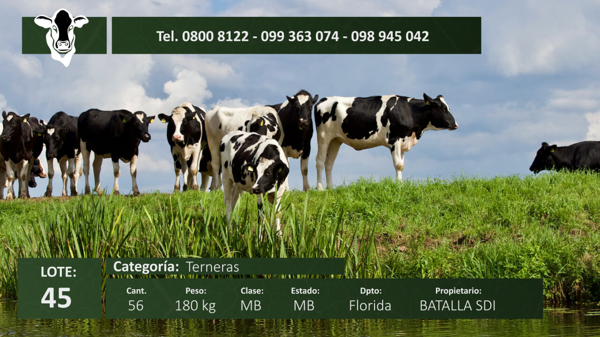

## This custom script for After Effects automate the manual process of setting huge amount of text content in different layers.




## Instructions:
- Edit the script according to your CSV file content.

```sh
# CSV file example:

Lote,Categoria,Cant.,Peso,Clase,Estado,Dpto,Propietario
-------------------------------------------------------
76,Terneras,71,184 kg,MBB,B,Durazno,EL PUESTO
45,Terneras,56,180 kg,MB,MB,Florida,BATALLA SDI
32,Vacas,78,160 kg,B,MBB,Canelones,BATALLA SDI
56,Toros,66,175 kg,MBB,MB,Flores,EL PUESTO
26,Toros,44,80 kg,MBB,MB,Flores,BATALLA SDI
77,Terneras,32,175 kg,MB,MB,Artigas,BATALLA SDI
98,Vacas,67,180 kg,MB,MB,Colonia,EL PUESTO
12,Toros,69,127 kg,MBB,B,San Jose,EL PUESTO
22,Vacas,61,166 kg,MBB,MBB,Flores,BATALLA SDI
35,Toros,68,189 kg,MB,MB,Maldonado,BATALLA SDI
```

- In After Effects go to Edit > Templates - Output module templates and set the default output to your preference.

- Run the script

- The script will read the CSV file and for every row, it will set the content in the text layers and render the composition. 